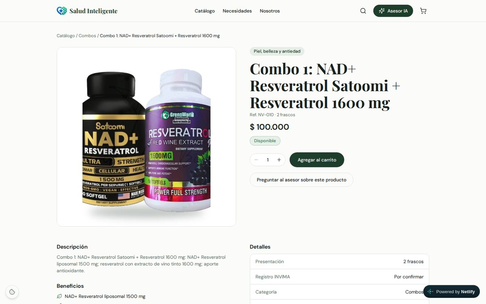
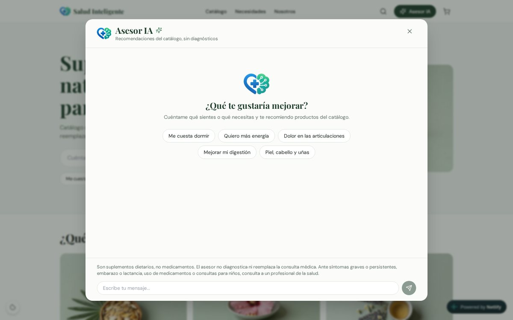
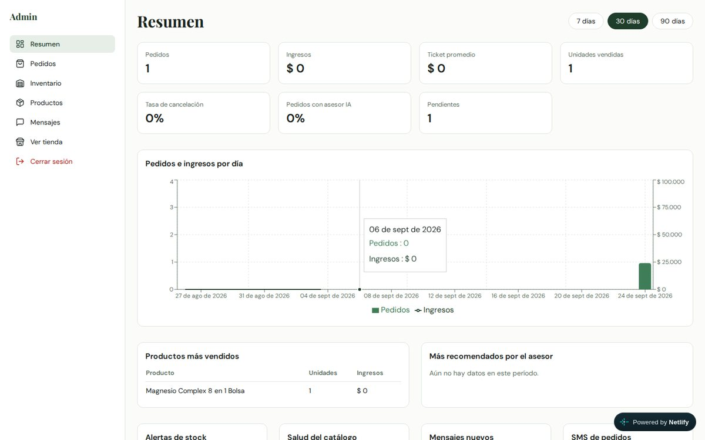
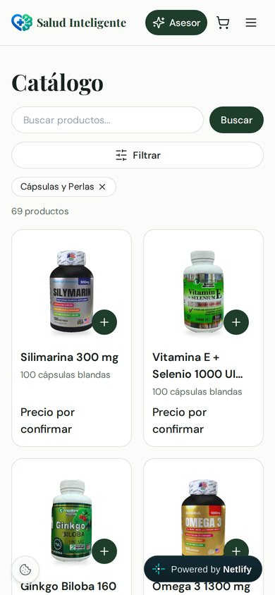
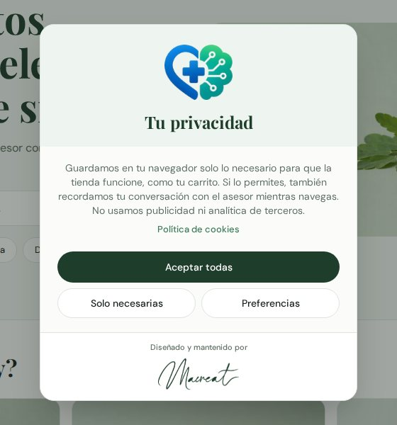

# salud-inteligente

Plataforma API-first para una tienda de suplementos naturales con asesor inteligente basado en IA (Claude).
Diseñada para distribuidoras y clientes en Colombia.

**En vivo:** tienda en [saludinteligente.lat](https://saludinteligente.lat) y API en [api.saludinteligente.lat](https://api.saludinteligente.lat/api/v1/health).


## Capturas

| Página de producto | Asesor IA |
| --- | --- |
|  |  |

| Panel de administración | Catálogo en celular | Aviso de cookies |
| --- | --- | --- |
|  |  |  |

## Arquitectura

La arquitectura sigue la de laVillaSB: un gateway en Laravel delante de microservicios FastAPI, con una tienda en React.

```
Navegador ──> React (Vite + Tailwind)  ──/api──>  Gateway Laravel 12  ──>  business      (9201)
              Netlify en producción                (8110, único punto      catalog       (9202)
              nginx en local (3200)                 público de la API)     inventory     (9203)
                                                                           orders        (9204)
                                                                           advisor       (9205) ──> Claude
                                                                           notifications (9206) ──> Twilio SMS
                                                          PostgreSQL 16 (una base de datos por servicio)
```

| Componente | Carpeta | Responsabilidad |
| --- | --- | --- |
| Tienda y panel | `app/frontend` | Catálogo, página de cada producto, carrito, pedidos, asesor IA, página de la API (`/api`), cookies y panel `/admin` |
| Gateway | `app/backend/gateway` | Rutas permitidas, autenticación de administrador (Sanctum), límites de uso, métricas del panel |
| Negocio | `app/microservices/business` | Perfil, canales de contacto, servicios, imágenes y mensajes de contacto |
| Catálogo | `app/microservices/catalog` | 337 productos en 12 categorías y 9 necesidades (fuente única de datos) |
| Inventario | `app/microservices/inventory` | Existencias, disponibilidad y reservas |
| Pedidos | `app/microservices/orders` | Carritos, pedidos, estados y métricas de ventas |
| Asesor | `app/microservices/advisor` | Asesor IA sobre el catálogo en vivo, sin diagnósticos |
| Notificaciones | `app/microservices/notifications` | SMS al negocio por cada pedido nuevo (Twilio) |

La especificación completa (propuesta, diseño con el contrato de la API, especificaciones y tareas) está en `openspec/changes/microservices-platform/`.

## API

Base: `https://api.saludinteligente.lat/api`.
Desde la tienda también responde en el mismo dominio, `https://saludinteligente.lat/api/...`, porque Netlify la reenvía al gateway.
Todas las respuestas son JSON; los errores tienen la forma `{"error": "mensaje en español"}`.

### Públicos

| Método | Ruta | Para qué | Límite por minuto |
| --- | --- | --- | --- |
| GET | `/v1/health` | Estado del gateway y de los seis servicios | - |
| GET | `/v1/business` | Perfil, contactos, servicios e imágenes del negocio | 120 |
| GET | `/v1/business/contacts` | WhatsApp, teléfono y demás canales | 120 |
| GET | `/v1/business/services` | Servicios del negocio | 120 |
| GET | `/v1/business/media` | Imágenes del sitio (`?kind=hero\|need\|gallery`) | 120 |
| POST | `/v1/business/contact-messages` | Enviar un mensaje de contacto | 5 |
| GET | `/v1/catalog/categories` | Categorías con número de productos | 120 |
| GET | `/v1/catalog/needs` | Necesidades (sueño, energía, ...) con imagen | 120 |
| GET | `/v1/catalog/products` | Productos con filtros `category`, `need`, `q`, `viral`, `trending`, `limit`, `offset` | 120 |
| GET | `/v1/catalog/products/{slug}` | Un producto | 120 |
| GET | `/v1/catalog/products/{slug}/related` | Productos relacionados | 120 |
| GET | `/v1/inventory/availability?refs=A,B` | Disponible, pocas unidades o agotado | 120 |
| POST | `/v1/cart` | Crear un carrito | 60 |
| GET | `/v1/cart/{token}` | Ver el carrito | 60 |
| PUT | `/v1/cart/{token}/items/{ref}` | Agregar o cambiar la cantidad de un producto | 60 |
| DELETE | `/v1/cart/{token}/items/{ref}` | Quitar un producto | 60 |
| DELETE | `/v1/cart/{token}/items` | Vaciar el carrito | 60 |
| POST | `/v1/orders` | Confirmar el pedido (devuelve el código y el enlace de WhatsApp) | 10 |
| GET | `/v1/orders/track/{code}?phone=` | Seguimiento de un pedido | 30 |
| POST | `/v1/advisor/chat` | Conversar con el asesor IA | 15 |

### Administración

Requieren `Authorization: Bearer <token>`, que se obtiene con `POST /admin/login`.

| Método | Ruta | Para qué |
| --- | --- | --- |
| POST | `/admin/login` | Iniciar sesión (5 intentos por minuto) |
| GET | `/admin/me` | Usuario actual |
| POST | `/admin/logout` | Cerrar sesión |
| GET | `/admin/dashboard?days=30` | KPIs: pedidos, ingresos, ticket promedio, unidades, cancelaciones, pedidos con asesor, inventario, mensajes |
| GET | `/admin/orders` | Pedidos con filtros por estado y búsqueda |
| GET | `/admin/orders/{id}` | Detalle e historial de un pedido |
| PATCH | `/admin/orders/{id}/status` | Cambiar el estado (pendiente, confirmado, enviado, entregado, cancelado) |
| GET | `/admin/inventory` | Existencias |
| PATCH | `/admin/inventory/{ref}` | Cambiar cantidad o umbral de alerta |
| GET | `/admin/products` | Productos, incluidos los inactivos |
| PATCH | `/admin/products/{ref}` | Precio, descripción o activación |
| GET | `/admin/messages` | Mensajes de contacto |
| PATCH | `/admin/messages/{id}` | Marcar como leído o archivado |
| PATCH | `/admin/business` | Editar perfil y canales de contacto |
| GET | `/admin/notifications` | SMS enviados por cada pedido |
| GET | `/admin/notifications/status` | Si Twilio está configurado y a qué número llegan los SMS |

### Ejemplos

```bash
# Productos para dormir mejor
curl "https://api.saludinteligente.lat/api/v1/catalog/products?need=sueno&limit=3"

# Un producto
curl "https://api.saludinteligente.lat/api/v1/catalog/products/combo-1-nad-resveratrol-satoomi-resveratrol-1600-mg-nv-010"

# Carrito y pedido
TOKEN=$(curl -s -X POST https://api.saludinteligente.lat/api/v1/cart | jq -r .token)
curl -X PUT "https://api.saludinteligente.lat/api/v1/cart/$TOKEN/items/NV-010" -H 'Content-Type: application/json' -d '{"quantity": 1}'
curl -X POST https://api.saludinteligente.lat/api/v1/orders -H 'Content-Type: application/json' \
  -d "{\"cart_token\": \"$TOKEN\", \"customer_name\": \"Ana\", \"customer_phone\": \"3001234567\", \"customer_city\": \"Pasto\"}"
```

La página [saludinteligente.lat/api](https://saludinteligente.lat/api) documenta los mismos endpoints y permite probar los GET en vivo.

## WhatsApp y SMS

- El botón "Enviar pedido por WhatsApp" abre un chat con el +57 301 8000324 con el pedido ya escrito (`BUSINESS_WHATSAPP`).
- Cada pedido nuevo envía un SMS al mismo número con Twilio (`TWILIO_ACCOUNT_SID`, `TWILIO_AUTH_TOKEN`, `TWILIO_FROM_NUMBER`).
  Si Twilio falla o no está configurado, el pedido se crea igual y el panel muestra el SMS como "no enviado".

## Desarrollo local

Requisitos: Docker con Compose v2.

```bash
# En .env (ignorado por Git): ANTHROPIC_API_KEY y las variables de deploy/env.example que necesites
docker compose up -d --build
```

| URL | Qué es |
| --- | --- |
| http://localhost:3200 | Tienda |
| http://localhost:3200/admin | Panel de administración (`admin@saludinteligente.lat` / `SaludAdmin2026!` solo en local) |
| http://localhost:3200/api | Documentación interactiva de la API |
| http://localhost:8110/api/v1/health | Estado del gateway y de cada servicio |
| http://localhost:9202/docs | OpenAPI de un servicio (9201 a 9206) |

## Pruebas

| Capa | Comando |
| --- | --- |
| Cada microservicio | `cd app/microservices/<servicio> && pip install -r requirements-dev.txt && python -m pytest -q` |
| Gateway | `cd app/backend/gateway && composer install && php artisan test` |
| Frontend | `cd app/frontend && npm ci && npm run lint && npm run test && npm run build` |

## Despliegue

La tienda se publica en Netlify (`netlify.toml`) con cada push a `main`.
La API corre en el VPS de laVillaSB (`/opt/salud-inteligente`), detrás de su Caddy, en `api.saludinteligente.lat`.
Guía paso a paso: [deploy/README.md](deploy/README.md).

## Equipo

Desarrollado por [Macreat](https://github.com/Macreat) y [pablomoreno-glitch](https://github.com/pablomoreno-glitch).

## Sitio anterior

El sitio estático original (`public/` y `netlify/functions/chat.js`) se conserva para poder volver a él; ver "Rollback" en la guía de despliegue.
